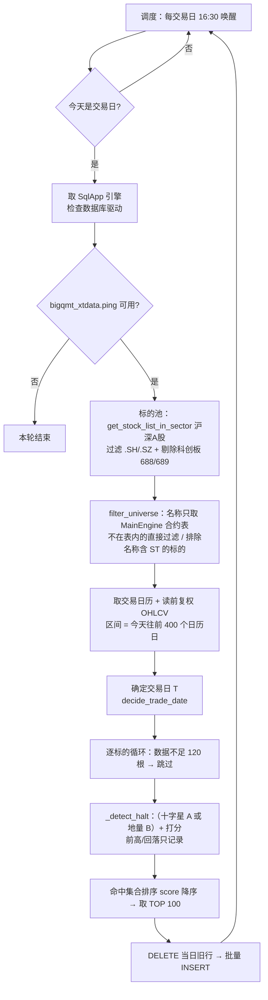

# `select_halt_downturn_xtquant.py` 选股逻辑完整说明

> 本文档描述 `script/select_halt_downturn_xtquant.py`（含 `select_halt_downturn_once.py` 复用的单轮逻辑）
> 的全市场扫描与选股口径，逐步骤给出公式、常量、边界条件与跳过原因。
> 所有默认值以源码顶部「可配置常量」区为准（严格档）。

---

## 1. 一句话概括

在全市场沪深 A 股（已去科创板 688/689、去 ST、去新股）中，寻找**“近 4 日中至少 2 个小十字星”（条件 A）
或者“今天（T）极致缩量、见地量”（条件 B）**的横盘缩量止跌信号（A、B 满足其一即可，两个都满足最强）；
按 **缩量程度 + 地量持平度 + 十字星规整度 + 连续天数** 打 0–100 分，取前 100 名写入
`stock_halt_downturn` 表，并附上 T 日的 MACD / KDJ / RSI 快照。

> **2026-09-29 起去掉了“前置下跌”闸门**（原：近 10 个交易日高点回落 ≥ 25% 才入选）。
> 实测该闸门单独就剔掉约 87% 的标的（全市场 4980 → 剩 620），而真正卡住候选的是条件 A/B；
> 现在前高与回落幅度只作为 `prior_peak_price` / `drop_from_peak_ratio` 两列入库留档，
> **不进筛选、不进打分、不进排序**。

---

## 2. 整体流程



单轮入口 `_run_once(engine, download_missing=None)`；`run(engine)` 负责调度循环。

---

## 3. 标的池构建（去哪找）

| 环节 | 实现 | 说明 |
| --- | --- | --- |
| 板块成分 | `market_data.get_all_stock_codes()` → `xtdata.get_stock_list_in_sector("沪深A股")` | `a_share.PRIMARY_SECTOR` |
| 回退板块 | `a_share.FALLBACK_SECTORS = ()` | 默认留空，即不回退（正常"沪深A股"总存在） |
| 市场过滤 | `code.endswith((".SH", ".SZ"))` | 防御性剔除北交所 `.BJ` 等 |
| 科创板过滤 | `_get_all_stock_codes()`，`EXCLUDE_CODE_PREFIXES = ("688", "689")` | 剔科创板股票与科创板 CDR，剔除时记日志（口径同 `select_near_ma_all_xtquant`） |
| 去重排序 | `sorted({...})` | 代码唯一 |
| ST 过滤 | `market_data.filter_universe()`，`EXCLUDE_ST = True` | 名称 `upper()` 含 `"ST"` 即剔除（覆盖 ST / *ST） |
| 名称来源 | `market_data.get_contract_names()`：读 MainEngine 已加载合约，**零 RPC** | 见下方说明 |
| 名称映射 | `name_map = dict(universe)` | `{code: name}`，入库时回填 `name` |

- **名称只从网关推送的合约表取，不再逐只查**：网关连接时会批量 `on_contract` → `MainEngine.contracts`
  （如 `vnpy_qmt` 会遍历"沪深A股"等板块推送全市场合约），`ContractData.name` 即 `InstrumentName`（"平安银行"），
  因此筛选阶段**不发任何 RPC**。
- **不在合约表里（或名称为空）的标的直接过滤**（不调用 `get_instrument_detail` 兜底）。
- 合约表 → xtquant 代码的映射：`contract.symbol` + `exchange` 后缀（`Exchange.SSE → .SH`、`Exchange.SZSE → .SZ`，
  即 `000001` + `SZSE` → `000001.SZ`）；只收录 SSE/SZSE 且名称非空的合约，期货 / 北交所 / 无名合约自动跳过。
- ⚠️ 前提：入口必须加载会批量推送合约的行情网关。若合约表为空，`filter_universe` 会记日志提示，
  并返回空池 —— 后续日志为"筛选后无可用标的，结束"，**整轮扫描不会发生**。
- 筛选循环按 `FILTER_BATCH_SIZE = 50` 分批打进度日志、并检查 `engine.is_active()`（不影响取名，取名不产生 RPC）。
- 用户点停止 → `filter_universe` 返回 `None` → 本轮结束。
- 板块名拿不到成分 → 直接返回空 → 记日志"大 QMT 未返回任何 A 股代码"结束。

---

## 4. 数据准备（读什么数据）

| 项 | 取值 | 说明 |
| --- | --- | --- |
| 读取区间 | `end_date = 今天`，`start_date = 今天 - READ_LOOKBACK_DAYS(400) 日历日` | 约覆盖 270 交易日，够 10 日下跌窗 + 60 日缩量参照窗 + `MIN_BARS(120)` 条门槛 + 缓冲 |
| 周期 | 日线 `1d` | — |
| 复权 | `DIVIDEND_TYPE = "front"`（前复权） | 与 `select_near_ma_*` 一致；`volume` 为未复权原值 |
| 字段 | `open / close / high / low / volume` | `market_data.OHLCV_FIELDS` |
| 分批 | `BATCH_SIZE = bigqmt_xtdata.READ_BATCH_SIZE` | 单次 RPC 超时有限，与桥内 chunk 对齐 |
| 补数 | `DOWNLOAD_MISSING = False` | 16:00 的 `select_near_ma_*` 已补好当日数据，本脚本直接读本地，省一轮全市场 RPC 探活 |
| 规范化 | `market_data.normalize_bars` | 只留 5 列，index 统一 `YYYYMMDD` 字符串并升序（兼容毫秒时间戳 / datetime / 字符串三种 index） |

- 单独运行本脚本（没有前置补数）时把 `DOWNLOAD_MISSING` 改 `True`；
  `select_halt_downturn_once.py` 手动补跑时**强制传 `download_missing=True`**。
- 读到的 `series_map` = `{code: DataFrame}`；用户停止 → 返回 `None` → 本轮结束；
  一只都没读到 → 抛错（提示去大 QMT「数据管理」补日线）。

### 4.1 确定交易日 T：`decide_trade_date`

1. 取每个标的 `close` 的**最后有效日期**，统计众数 `freq`，总数 `total`；
2. 从日历**最近端往前**找第一个满足 `freq[date] >= total * 0.5` 的日子；
   - 若该日不是日历最后一天，说明"当日数据未就绪"，记日志改用前一交易日；
3. 若日历内无满足者，回退到 `freq` 最大的日期（并记日志）。
4. 一条有效收盘价都没有 → 抛错。

> 目的：盘中/当日数据还没落地时，自动把 T 退到上一个交易日，避免整批判定失真。

### 4.2 数据量门槛

`bars["close"].dropna().size < MIN_BARS(120)` 的标的**直接跳过**，并计入 `skipped_few_bars`
（剔除上市太近的新股与长期停牌标的）。判定完成后日志汇总：
`命中 N 个止跌形态，因日线数据不足 120 条剔除 M 个`，随后紧跟**判定漏斗**日志（见 6.1）。

---

## 5. 核心判定：`_detect_halt(bars, trade_date)`

> **一句话总结：“躺平（出现小十字星）”与“没人交易（缩量地量）”两者满足其一即可；
> 十字星与地量是选择题（两个都满足最强，都不满足则淘汰），没有其他硬条件。**

前置：`trade_date` 必须在 `bars.index` 中，否则返回 `None`。取 `pos = index.get_loc(trade_date)`，
`row_t = bars.iloc[pos]`。

**T 日收盘价缺失或 `close <= 0` → 跳过。**
### 5.1 步骤 1：下跌前高与回落幅度（**仅记录，不参与判定**）

> **一句话：把“近 10 个交易日（不含今天）的最高价”和“现价相对它跌了多少”算出来存进表，
> 只当背景信息看 —— 它不过滤、不打分、不参与排序。**

```python
lo = max(0, pos - DOWNTURN_LOOKBACK)          # DOWNTURN_LOOKBACK = 10（仅记录窗口）
hist = bars.iloc[lo:pos]                       # T 日之前的 10 个交易日（不含 T）
hist_valid = hist.loc[_tradable_mask(hist), "high"]
```

- **有效交易日掩码** `_tradable_mask`：

  $$\text{valid} = \text{volume 非空} \wedge \text{high 非空} \wedge \text{low 非空} \wedge (\text{volume} > 0) \wedge (\text{high} > 0) \wedge (\text{high} > \text{low})$$

  即剔除停牌 / 一字板（`high == low`）/ 异常日。

- 算出则入库：`prior_peak_price = hist_valid.max()`，`drop_from_peak_ratio = 1 - close_T / high_max`；
- **算不出就写 NULL**：有效日数 < `MIN_WINDOW_POINTS(3)` 或 `high_max <= 0` → 两列都写 NULL，
  **不因此剔除标的**（这两列只是留档）。

> 窗口右端**不含 T**：前高取的是“最近 10 个交易日内（不含今天）的有效最高价”；
> 数据不足 10 根时按实际可用根数（`max(0, pos-10)`）计算。
> 这两个字段可用来事后复盘“当前这一批标的算不算跌过”，
> 例如 `WHERE drop_from_peak_ratio >= 0.2` 就能只挑出深跌过的那些（筛选在 SQL 里做，脚本不做）。
> 实现见 `_drop_from_high(bars, pos, window, close_t)`（返回 `(high_max, drop_pct)` 或 `None`）。

### 5.2 步骤 2：近端十字星（最近 4 日中至少 2 个小十字星）

> **一句话：最近 4 天（含今天）里，至少有 2 天是“小十字星” —— 开盘价和收盘价几乎一样（实体 ≤ 振幅的 25%）、
> 当天最高最低差不到 4%，且上下都留着一点影线。**
> 意思是最近这段多空双方都没什么力气、价格反复躺平了；这 4 天里其余的天可以是大阳线、大阴线，
> 但十字星数不到 2 天就不算。

```python
star_lo = pos - STAR_DAYS + 1     # STAR_DAYS = 4
if star_lo < 0: return None        # 上市不足 4 根，跳过
tail = bars.iloc[star_lo : pos + 1]   # 含 T 的最近 4 根
```

对 `tail` **逐根**调用 `_is_doji(row)` **统计十字星天数**（不再要求逐日全部满足）：

- `doji_days` = `tail` 中是十字星的根数；`doji_days < MIN_DOJI_DAYS(2)` → 条件 A **不成立**
  （不直接跳过：还要看 5.3 的条件 B，两者取“或”；不必连续、不要求最后一天是十字星）；
- 其余非十字星的日子**不限形态**（大阳/大阴/跳空都行）。

单根要算“小十字星”需同时满足：

| 条件 | 表达式 | 含义 |
| --- | --- | --- |
| 数值完整 | `open/close/high/low/volume` 均非 NaN | 缺数据即否 |
| 非停牌 | `volume > 0` 且 `high > 0` 且 `high > low` | 排除停牌、一字板（`high==low`） |
| 振幅非零 | `rng = high - low > 0` | — |
| 实体小（十字） | $\dfrac{\vert close - open \vert}{rng} \le \text{BODY\_RATIO} = 0.25$ | 实体占振幅 ≤ 25% |
| 振幅小（小 K 线） | $\dfrac{rng}{close} \le \text{RANGE\_RATIO} = 0.04$ | 单日振幅 ≤ 4%（$rng = H-L$） |
| 上下影线都 > 0 | `high - max(open, close) > 0` **且** `min(open, close) - low > 0` | 固定要求（没有开关），排除一字板 / T 字板，保留“真十字星” |

记录十字星日的平均实体占比（用于打分）—— **只对是十字星的那几天取平均**，
把大阳线/大阴线算进来会把“规整度”拉歪：

$$\text{body\_ratio\_mean} = \frac{1}{n_{doji}}\sum_{i \in doji} \frac{|close_i - open_i|}{high_i - low_i}$$

> ⚠️ 本节（条件 A）**不是硬性必选**：十字星不足时还会看 5.3 的量能条件（条件 B），两者取“或”。
> 4 天内一天十字星都没有时，`doji_body_ratio` 入库为 NULL（没有“规整度”可言，打分时算 0 分）。

### 5.3 步骤 3：极致缩量（只看 T 当天）

> **一句话：今天（T）这一天的成交量，既要缩到之前 60 天平均量的 40% 以下，又不能超过之前 60 天最低量的 1.2 倍。**
> 价格躺平的同时今天的成交也干涸了（没量了）—— 卖压基本出完、没人在这个价位肯再割了，这就是“地量”。

**近端量能**（= T 当天那一根，不再用近 4 日窗口）：

```python
t_row = bars.iloc[pos : pos + 1]
if not _tradable_mask(t_row).iloc[0]: return None   # T 日停牌/一字板：量不可信，直接跳过
vol_t = row_t["volume"]                 # 唯一的“近端量”：缩量闸门与地量持平都用它
# 近 4 日有效交易日均量只作记录（不参与筛选/打分），供复盘看近几天量能水平
tail_valid     = tail.loc[_tradable_mask(tail), "volume"]
vol_avg_star = tail_valid.mean() if tail_valid.size else None
```

**参照窗口**（T 之前的 60 个交易日，**紧邻 T**、不含 T）：

```python
ref_lo = max(0, pos - VOL_REF_DAYS)     # VOL_REF_DAYS = 60
ref_hi = pos                            # 不含 T
ref = bars.iloc[ref_lo:ref_hi]
ref_valid = ref.loc[_tradable_mask(ref), "volume"]
```

- `ref_valid.size < MIN_WINDOW_POINTS(3)` → **跳过**；
- `vol_ref = ref_valid.mean()`、`vol_min_ref = ref_valid.min()`（**均已剔除停牌日**）；`vol_ref <= 0` → **跳过**；
- 条件 B 的两条子条件（**都满足才算 B 成立**；B 不成立时看条件 A 是否成立）：
  1. 缩量：

$$
\text{shrink\_ratio} = \frac{vol_T}{\text{vol\_ref}} \le \text{VOL\_SHRINK\_RATIO} = 0.40
$$

  2. 地量倍数：

$$
\frac{vol_T}{vol\_min\_ref} \le \text{VOL\_MIN\_MULTIPLE} = 1.2
$$

> 为什么要两条：只看均量会被“巨量天”骗过——一个月里有一天放天量，均量被抬高，
> 今天缩到它的 40% 可能离真地量还差很远。倍数这条直接问：今天的地量跟前 60 日**最低量**比，是不是 1.2 倍以内。

- `vol_min_ref` 同时还用于 5.4 的“地量持平度”打分。

> `vol_today` = T 日成交量（两个闸门与 5.4 都与它有关）；`vol_min_before` = 参照窗最低量
> （地量倍数闸门 + 地量持平度打分都用它）；`vol_avg_star` = 近 STAR_DAYS 日有效交易日均量（**仅记录**）。
> 三者都入库，供复盘看 T 当天离前 60 日最低量有多远、近几天量能水平如何。

> ⚠️ 本节（条件 B）同样**不是硬性必选**：两个闸门都不过时，只要 5.2 的十字星条件成立即入选。
> 换句话说 `_detect_halt` 里是：`if not (star_ok or shrink_ok): return None`。
> 注：T 日停牌/一字板、参照窗有效量不足这类**数据质量**问题仍是硬性淘汰（不然停牌 0 量会被当成“极致缩量”）。

### 5.4 步骤 4：打分（0–100）

> **一句话：给每个已经命中的标的算个 0-100 的分数，好排序取前 100。**
> 分从四个地方来：缩量缩得越狠（30 分）、今天（T）的成交量跟前 60 日最低量是否基本持平（20 分）、
> 十字星越规整（30 分）、十字星往前连续得越多（20 分）；分数越高 = 形态越“标准”，同分时按代码先后排。
> 注意：当前严格档下缩量那 30 分**人人都拿满**，实际拉开差距的是剩下三项（原因见下方 ⚠️）。

```python
vol_score   = clamp((1 - shrink_ratio) / (1 - VOL_SHRINK_RATIO), 0, 1)
# 地量持平度：T 日成交量 相对 前 VOL_REF_DAYS 日最低量 的偏差在 ±20% 以内
floor_score = 1.0 if abs(vol_t / vol_min_ref - 1.0) <= VOL_FLOOR_TOLERANCE else 0.0
star_score  = clamp(1 - body_ratio_mean, 0, 1)

extra = 0                      # 从 pos-STAR_DAYS 继续向前数连续小十字星的额外天数
i = pos - STAR_DAYS
while i >= 0 and _is_doji(bars.iloc[i]):
    extra += 1; i -= 1
cont_score = min(extra / 3.0, 1.0)

score = round(100 * (0.3 * vol_score + 0.2 * floor_score + 0.3 * star_score + 0.2 * cont_score))
if score <= 0: return None
```

$$\text{score} = 100 \times \Big(0.3 \cdot s_{vol} + 0.2 \cdot s_{floor} + 0.3 \cdot s_{star} + 0.2 \cdot s_{cont}\Big)$$

| 分项 | 权重 | 定义 | 取值区间 |
| --- | --- | --- | --- |
| 缩量程度 $s_{vol}$ | 30% | $\dfrac{1 - \text{shrink\_ratio}}{1 - 0.40}$，截断到 [0,1] | 见下方 ⚠️ |
| 地量持平度 $s_{floor}$ | 20% | **T 日成交量**与前 60 日**最低量**的相对偏差 $\vert \frac{vol\_today}{vol\_min\_before} - 1 \vert \le 0.20$ 则得满分，否则 0 分（不硬筛） | $\{0, 1\}$ |
| 十字星规整度 $s_{star}$ | 30% | $1 - \text{body\_ratio\_mean}$（实体越小越规整）；**4 天内没十字星时这一项 0 分** | $\{0\} \cup [0.75, 1]$ |
| 连续天数 $s_{cont}$ | 20% | $\min(\text{extra}/3, 1)$，即向前每多 1 根连续十字星加 1/3 | $\{0, \frac13, \frac23, 1\}$ |

> 地量持平的含义：今天已经缩到跟前 60 日最低量差不多的水平（±20% 浮动内就算“持平”），
> 即所谓的“地量见地价”，而不是“横盘但量还在中高位”。注意它是**打分项不是闸门**，
> 不持平不会被剔除，只是少得 20 分、排序靠后。
> 另外：上界（1.2 倍）已被 5.3 的“地量倍数”闸门卡住，所以这一项实际只管**下界**（不得低于 0.8 倍）。

**十字星天数记录**：入库列 `doji_days = doji_in_window + extra`
（= 近 4 日内十字星数 + 从窗口往前连续延续的十字星数；两者相加就是“一共多少根十字星在参与判定”；
代码里的局部变量叫 `doji_in_window`，避免与列名同名混淆）。

> ⚠️ **重要特性**：由于归一化分母 `1 - VOL_SHRINK_RATIO = 0.6` 与筛选阈值完全一致，
> 任何**通过筛选**的标的都满足 `shrink_ratio ≤ 0.4`，于是 $s_{vol} \ge 1$ 必然被截断为 **1.0**。
> 也就是说**缩量项在严格档下恒为满分，只起“闸门”作用，不产生排序区分度**；
> 这也是把它的权重从 50% 调成 30%、腾出 20% 给真正有区分度的“地量持平度”的原因。
> 实际区分度来自地量持平度（20%）、十字星规整度（30%）与连续天数（20%）。
> 而且因为 A/B 是“或”关系，只靠一支入选的标的在另一支上自然拿不到分（例：靠量能入选但没十字星 → 规整度 0 分）。
> 因此命中标的的分数区间实际约为 **22–100**
> （理论下限 ≈ $100 \times 0.3 \times 0.75 = 22.5$：靠十字星入选但量能完全不达标、且无连续延续时的最差分），
> `score <= 0` 的兜底分支基本不会触发。
> 若想让缩量程度也参与排序，需放宽 `VOL_SHRINK_RATIO`（例如 0.6）或改变归一化分母。

### 5.5 步骤 5：T 日指标快照

> **一句话：只是“顺便”把今天的 MACD / KDJ / RSI 数值也记下来存到表里。**
> 这三项**完全不参与**刚才的形态判定和打分，纯粹是给你拿去复盘或做二次筛选用的；
> 而且只有形态全部命中才会去算（不给全市场都在白算指标）。

**仅在形态全部命中后**才计算（不给全市场都算 MACD/KDJ，省算力）：

```python
snapshot = ind.latest(bars.loc[:trade_date], _INDICATOR_SPECS)   # 只用到 T 日为止的窗口
```

- `_INDICATOR_SPECS = {"macd": {}, "kdj": {}, "rsi": {}}` —— 参数留空表示用
  `script/talib/indicators.py` 顶部「默认参数」区的通用默认口径
  （`MACD_FAST=12 / MACD_SLOW=26 / MACD_SIGNAL=9`、`KDJ_N=9 / M1=3 / M2=3`、`RSI_N=14`）。
  要为本脚本单独改口径就在这里覆盖，例如 `{"macd": {"fast": 5}}`。
- 列映射与小数位（`_INDICATOR_FIELDS`）：

| 指标输出 | 入库列 | 保留小数 | 口径 |
| --- | --- | --- | --- |
| `DIF` | `macd_dif` | 4 | $\text{EMA}(close,12) - \text{EMA}(close,26)$ |
| `DEA` | `macd_dea` | 4 | $\text{EMA}(DIF,9)$ |
| `MACD` | `macd_bar` | 4 | $2 \times (DIF - DEA)$（国内口径，柱乘 2） |
| `K` | `kdj_k` | 2 | $\text{SMA}(RSV, 3, 1)$，初值 50 |
| `D` | `kdj_d` | 2 | $\text{SMA}(K, 3, 1)$，初值 50 |
| `J` | `kdj_j` | 2 | $3K - 2D$ |
| `RSI14` | `rsi` | 2 | Wilder 平滑（等价 `SMA(X,14,1)`） |

  其中 $RSV = \dfrac{C - LLV(L,9)}{HHV(H,9) - LLV(L,9)} \times 100$，窗口内 `HHV == LLV` 时 RSV 取平台值，
  RSI 的涨幅/跌幅均为 0 时取中性 50。
- 数据不足时 `indicators.latest` 返回 NaN，经 `_opt_float`（NaN / inf / 转换失败 → `None`）统一落 **NULL**。

### 5.6 命中返回字典（键必须与建表/INSERT 列名一致）

> **一句话：把上面算出来的东西（价格、跌幅、量能、分数、指标）打包成一个 dict 交给调用方，
> 键名就是数据库列名，少一个键写库时就会直接报错。**

```
close_price, prior_peak_price, drop_from_peak_ratio,
vol_avg_star, vol_today, vol_avg_before, vol_min_before, vol_shrink_ratio,
doji_days, doji_body_ratio,
macd_dif, macd_dea, macd_bar, kdj_k, kdj_d, kdj_j, rsi,
score
```

数值取整：价格 2 位、比例/均值 4 位、量 0 位（`round(vol, 0)`）、`score` 为整数。

---

## 6. 排序与截断

```python
hits.sort(key=lambda x: (-x["score"], x["code"]))   # 分数降序，同分按代码升序
top = hits[:TOP_N]                                   # TOP_N = 100
```

- 无命中 → 记日志"无标的命中止跌形态"结束（**不写库**）；
- 有命中 → 记日志 `取前 N 个入库，最高分 X，最低分 Y`。

循环期间每处理 **1000** 只打一次进度日志并检查 `engine.is_active()`（被停止则直接 return 结束本轮）。

### 6.1 判定漏斗日志（每一步过滤掉多少）

命中数很少（甚至为 0）时，光有"命中 N 个"无法定位是哪一步把池子筛空的，
所以每只标的会在**第一个未通过的步骤**被记一次数（`_Funnel` + `_reject`），
跑完立刻打一份漏斗日志；A/B 是"或"关系，另附条件分布。

- 计数严格：`各步剔除数之和 + 命中数 = 参与判定总数`；
- 顺序即判定顺序，与 `_detect_halt` 的提前返回一一对应；
- `_detect_halt(bars, trade_date, funnel=None)` 的 `funnel` 省略时**完全不开销**（便于单只调试）。

```text
判定漏斗（T=20260929）：读到行情 5024 个，日线不足 120 条剔除 44 个（0.9%），参与判定 4980 个
  第 1 步 T 日无收盘价或收盘价<=0：剔除 0 个（0.0%），剩余 4980 个
  第 2 步 近端窗口不足 4 根（上市太近）：剔除 0 个（0.0%），剩余 4980 个
  第 3 步 T 日停牌/一字板（量不可信）：剔除 6 个（0.1%），剩余 4974 个
  第 4 步 缩量参照窗口有效交易日不足 3 天：剔除 0 个（0.0%），剩余 4974 个
  第 5 步 前 60 日均量<=0：剔除 0 个（0.0%），剩余 4974 个
  第 6 步 十字星不足 2 天且未缩量（条件 A、B 都不满足）：剔除 4949 个（99.4%），剩余 25 个
  第 7 步 综合打分<=0：剔除 0 个（0.0%），剩余 25 个
  命中（进入排序）：25 个（0.5%）
  条件 A/B 分布（走到该步的 4974 个）：仅 A（近 4 日十字星 >= 2 天） 18 个，仅 B（T 日极致缩量且为地量） 6 个，A、B 同时成立 1 个，都不满足 4949 个
```

> 读法："剩余"= 通过前 N 步的标的数，百分比 = 该步剔除数 / 参与判定总数。
> 现在真正卡人的只有**第 6 步（A/B 都不满足）**，而 A/B 里面量能条件（B）比十字星（A）宽松得多，
> 所以命中集合以"仅 B"为主；若要再多出票，就得调 `VOL_SHRINK_RATIO` / `VOL_MIN_MULTIPLE`
> 或 `BODY_RATIO` / `RANGE_RATIO` / `MIN_DOJI_DAYS`，而不是调前高相关常量。

上游（通用层 `market_data`）也会打印每一步的过滤量，构成从板块成分到入库的完整链条：

```text
筛选完成：输入 5052 个，保留 5040 个（合约表未覆盖剔除 0 个，ST/*ST 剔除 12 个）
行情读取完成：5024/5040 只有数据（16 只无数据）
```

---

## 7. 入库：`_save_results`

- 表名 `TABLE_NAME = "stock_halt_downturn"`，主键 `(trade_date, code)`。
- **幂等写入、历史不清理**：同一交易日内先 `DELETE FROM ... WHERE trade_date = ?` 再批量
  `executemany` 插入（整个操作包在一个 `sql_engine.transaction()` 里）。
- 占位符按驱动选择：`sqlite` → `?`，其它（mysql）→ `%s`。
- 建表语句中列说明直接写成 `--` **行内 SQL 注释**（sqlite 会存进 `sqlite_master.sql`，`.schema` 可见）；
  注意逗号必须写在注释之前，否则会被注释掉。
- 表结构变动**不做自动迁移**：新增字段用 `ALTER TABLE ... ADD COLUMN`，改名用 `RENAME COLUMN`。
- ⚠️ **2026-09 有过一次改名**（改成 T 日口径后的语义对齐），旧表需手动执行（SQLite ≥ 3.35 / MySQL 8 均支持）：

  ```sql
  ALTER TABLE stock_halt_downturn RENAME COLUMN vol_min_recent TO vol_today;      -- 现在存 T 日成交量
  ALTER TABLE stock_halt_downturn RENAME COLUMN vol_avg_recent TO vol_avg_star;    -- 现在只作记录
  ALTER TABLE stock_halt_downturn RENAME COLUMN doji_streak_days TO doji_days;
  ```

  不改也能跑（脚本按新列名 INSERT，旧表会因列不存在而报错）；历史行里的旧值含义见本表注释。

### 7.1 表字段一览（21 列）

| 列 | 类型 | 含义 |
| --- | --- | --- |
| `trade_date` | VARCHAR(8) | 交易日 T（`YYYYMMDD`），主键之一 |
| `code` | VARCHAR(16) | 标的代码，如 `000001.SZ`，主键之一 |
| `name` | VARCHAR(64) | 标的名称（已排除 ST/*ST） |
| `close_price` | REAL | T 日收盘价（前复权） |
| `prior_peak_price` | REAL | 下跌前高点：近 10 日（不含 T）有效最高价（**仅记录**，算不出为 NULL） |
| `drop_from_peak_ratio` | REAL | 相对前高回落比例（**仅记录**，不参与筛选/打分/排序） |
| `vol_avg_star` | REAL | 近 STAR_DAYS 日有效交易日均量（**仅记录**，不参与筛选/打分） |
| `vol_today` | REAL | **T 日成交量**（地量；缩量闸门、地量倍数闸门、地量持平打分都用它） |
| `vol_avg_before` | REAL | 之前 60 日（紧邻 T）平均成交量（剔除停牌） |
| `vol_min_before` | REAL | 之前 60 日（紧邻 T）最小成交量（剔除停牌；地量倍数闸门 + 地量持平度打分都用它） |
| `vol_shrink_ratio` | REAL | 缩量程度 = T 日量 / 前 60 日均量（条件 B 要求 ≤ 0.40 且 ≤ 前 60 日最低量 × 1.2） |
| `doji_days` | INTEGER | 十字星天数 = 近 4 日内十字星数 + 向前连续延续数（可为 0） |
| `doji_body_ratio` | REAL | 近 4 日中十字星日的实体/振幅均值（越小越规整；**无十字星时为 NULL**） |
| `macd_dif` / `macd_dea` / `macd_bar` | REAL | T 日 MACD 三值 |
| `kdj_k` / `kdj_d` / `kdj_j` | REAL | T 日 KDJ 三值 |
| `rsi` | REAL | T 日 RSI（周期随 `_INDICATOR_SPECS["rsi"]`，默认 14） |
| `score` | INTEGER | 综合打分 0–100 |

---

## 8. 调度与容错（`run`）

| 行为 | 实现 |
| --- | --- |
| 触发点 | 每交易日 `RUN_HOUR:RUN_MINUTE = 16:30`（排在 `select_near_ma_*` 的 16:00 补数之后） |
| 首次执行 | 启动后**等待下一个 16:30**，不立即触发（`next_run_dt`：若 now 恰等于触发点也算"下一个"） |
| 非交易日 | `market_data.is_trading_day(today)` 为假 → 记日志跳过，等下一轮 |
| 停止响应 | `market_data.sleep_until` 分段睡眠（每步 ≤ `SLEEP_STEP_SECONDS=60` 秒）检查 `engine.is_active()` |
| 单轮异常 | `try/except` 捕获并写日志（含 traceback），**不影响后续轮次** |
| 退出 | `engine.is_active()` 为假 → 退出循环，记日志"调度已停止" |

依赖：SqlApp（`vnpy_sqlapp`，`APP_NAME`）必须先加载，否则抛 `RuntimeError`；大 QMT RPC 不可用则本轮直接结束。

---

## 9. 常量总表（严格档默认值）

| 常量 | 默认 | 作用 |
| --- | --- | --- |
| `DOWNTURN_LOOKBACK` | 10 | “下跌前高”的记录窗口（交易日，不含 T）；**仅记录**，不参与筛选/打分 |
| `STAR_DAYS` | 4 | 近端十字星观察窗口（含 T） |
| `MIN_DOJI_DAYS` | 2 | 上面这 4 天里至少要有的小十字星天数（不必连续） |
| `BODY_RATIO` | 0.25 | 实体占振幅上限，$\vert C-O \vert / (H-L) \le 0.25$ |
| `RANGE_RATIO` | 0.04 | 单日振幅上限，`(H-L)/C ≤ 4%` |
| `VOL_REF_DAYS` | 60 | 缩量参照窗口（交易日，紧邻 T 之前，不含 T） |
| `VOL_SHRINK_RATIO` | 0.40 | T 日成交量 ≤ 参照窗均量 × 40% |
| `VOL_FLOOR_TOLERANCE` | 0.20 | “地量持平”容差：T 日成交量与参照窗最低量的偏差在 ±20% 内算持平（打分项，不硬筛） |
| `VOL_MIN_MULTIPLE` | 1.2 | 地量倍数上限（**硬筛**）：T 日成交量 ≤ 参照窗最低量 × 1.2 |
| `MIN_WINDOW_POINTS` | 3 | 均量/高点窗口剔除停牌后至少需有的有效日数 |
| `MIN_BARS` | 120 | 标的可用前复权日线少于此值不考虑 |
| `DIVIDEND_TYPE` | `"front"` | 前复权 |
| `BATCH_SIZE` | `bigqmt_xtdata.READ_BATCH_SIZE` | 每批读取标的数 |
| `DOWNLOAD_MISSING` | False | 是否先探覆盖 + 补缺当日数据 |
| `TOP_N` | 100 | 入库条数上限 |
| `EXCLUDE_CODE_PREFIXES` | `("688", "689")` | 剔除科创板股票 / 科创板 CDR（北交所在通用层已过滤） |
| `TABLE_NAME` | `stock_halt_downturn` | 结果表 |
| `READ_LOOKBACK_DAYS` | 400 | 读取区间近端日历日数 |
| `RUN_HOUR` / `RUN_MINUTE` | 16 / 30 | 每日执行时刻 |
| `EXCLUDE_ST` | True（在通用层） | 排除 ST/*ST |

指标周期（`MACD_*` / `KDJ_*` / `RSI_N`）**不在本脚本**，统一在 `script/talib/indicators.py` 顶部的
「默认参数」区，避免同名参数两处漂移。

---

## 10. 跳过原因速查表

| 阶段 | 跳过条件 | 记录方式 |
| --- | --- | --- |
| 取数前 | 大 QMT RPC 不可用 / 无 A 股代码 / 筛选后无标的 | 日志，结束本轮 |
| 标的级 | `close.dropna().size < 120` | 计入 `skipped_few_bars`，漏斗日志首行单列 |
| `_detect_halt` | T 日不在 index 中 / T 日收盘 NaN 或 ≤ 0 | 漏斗第 1 步 `no_t_close` |
| 步骤 1 | （前高算不出 → `prior_peak_price` / `drop_from_peak_ratio` 写 NULL，**不剔除**） | — |
| 步骤 2 | 最近 4 日不足（`star_lo < 0`，实际上不会发生：`MIN_BARS=120` 已保障） | 漏斗第 2 步 `star_window`（防御） |
| 步骤 3 | **T 日非有效交易日（停牌/一字板）** | 漏斗第 3 步 `t_not_tradable` |
| 步骤 3 | 参照窗有效量 < 3 个 / `vol_ref ≤ 0` | 漏斗第 4/5 步 `vol_ref_window` / `vol_ref_zero`（防御） |
| 步骤 2+3 | **十字星不足 2 日（A 不成立）且量能也不达标（B 不成立）** | 漏斗第 6 步 `no_form_no_vol` + A/B 分布行 |
| 步骤 4 | `score <= 0`（严格档下几乎不发生） | 漏斗第 7 步 `score_zero`（防御） |
| 其他 | 每 1000 只检查一次用户停止 | 日志并结束本轮 |

> 上表"漏斗第 N 步"= `_FUNNEL_LABELS` 里的键，也是 `_Funnel.rejects` 的键；日志逐条打印
> `剔除几个 / 剩余几个`（见 6.1）。标为「防御」的步骤在正常数据下恒为 0，出现非 0 说明数据异常。
>
> 注意：**"地量持平度"不在上表**——它只影响分数，不满足也只是少得 20 分（排序靠后），不会被剔除。
> 同理，条件 A 或 B **任一成立**即可入选（第 8 步只在两个都不成立时才剔除）。

---

## 11. 伪代码（单标的）

```text
detect(bars, T):
    if T not in bars.index: return None
    pos   = index_of(T);  close_t = close[pos]
    if close_t is NaN or close_t <= 0: return None

    # 1) 前高与回落幅度：只记录（入库 prior_peak_price / drop_from_peak_ratio），不算条件
    hist  = bars[pos-10 : pos]                            # 不含 T
    highs = [h for h in hist.high if tradable]            # volume>0, high>0, high>low
    if len(highs) >= 3:
        peak = max(highs);  drop = 1 - close_t / peak      # peak/ drop 入库
    else:
        peak = drop = None                                 # 写 NULL，不影响是否入选

    # 2) 近端 4 日内至少 2 个小十字星（不必连续）→ 条件 A
    tail = bars[pos-3 : pos+1]
    if len(tail) < 4: return None
    doji = [row for row in tail
            if row 可交易 and |C-O|/(H-L) <= 0.25 and (H-L)/C <= 0.04 且上下影线都 > 0]
    star_ok = len(doji) >= 2
    body_ratio_mean = mean(|C-O|/(H-L) for row in doji) if doji else None   # 无十字星 → NULL / 0 分

    # 3) 极致缩量（只看 T 当天；参照窗紧邻 T）
    if not tradable(T row): return None                   # T 日停牌/一字板
    vol_t = volume[T]
    ref   = bars[pos-60 : pos]                            # 之前 60 日（不含 T）
    vols  = [v for v in ref.volume if tradable]
    if len(vols) < 3: return None
    vol_ref    = mean(vols);  vol_min_ref = min(vols)
    if vol_ref <= 0: return None
    shrink     = vol_t / vol_ref
    shrink_ok  = (shrink <= 0.40) and (vol_t <= vol_min_ref * 1.2)   # 条件 B
    if not (star_ok or shrink_ok): return None                      # A、B 取“或”

    # 4) 打分
    vol_score   = clamp((1 - shrink) / 0.6, 0, 1)         # 通过筛选时恒为 1
    floor_score = 1 if |vol_t / vol_min_ref - 1| <= 0.20 else 0
    star_score  = clamp(1 - body_ratio_mean, 0, 1)
    extra       = 向前继续数连续十字星的根数
    cont_score  = min(extra / 3, 1)
    score       = round(100 * (0.3*vol_score + 0.2*floor_score + 0.3*star_score + 0.2*cont_score))
    if score <= 0: return None

    # 5) 指标快照（MACD/KDJ/RSI，只用到 T 日）
    return { ...结果字段, macd_*, kdj_*, rsi, score }
```

---

## 12. 设计取舍与注意事项

1. **前复权全量重读**：前复权下历史价会随分红整体位移，所以每轮都读全区间，**不做增量拼接**。
2. **形态相符不是买入信号**：命中只代表符合“横盘 / 缩量”形态，不代表底部已确认；
   是否入场需结合后续 K 线确认（本脚本只负责筛选与入库）。
   （2026-09-29 起不再要求“前期跌过”，想按跌幅筛就查 `drop_from_peak_ratio` 列。）
3. **停牌处理口径**：T 日本身必须是有效交易日（停牌/一字板直接拒）；
   近端 4 日窗口不要求天天可交易（只要求其中至少 2 天是有效十字星）；
   参照窗（前 60 日）剔除停牌/一字板后要求至少 `MIN_WINDOW_POINTS = 3` 个有效日。
4. **T 日量与前 60 日最低量的关系既有硬筛也有打分**：
   - 硬筛（地量倍数，`VOL_MIN_MULTIPLE = 1.2`）：T 日成交量 > 前 60 日最低量 × 1.2 直接跳过；
   - 打分（地量持平度，`VOL_FLOOR_TOLERANCE = 0.20`，占 20%）：相对偏差在 ±20% 内（即 0.8~1.2 倍）得满分，否则 0 分。
   由于闸门已经把上界卡在 1.2 倍，打分项实际上只剩“**不得低于 0.8 倍**”这一侧在起作用（低于视为异常/不押）。
   两者都入库（`vol_today` / `vol_min_before`），供复盘看 T 当天离前 60 日最低量有多远。
   注意：**参照窗是紧邻 T 的前 60 日（含 T-1~T-3）**，所以近几天已经在缩量时，`vol_min_before` 本身就很低，
   倍数条件更难满足；若想放松，可调大 `VOL_MIN_MULTIPLE` 或把参照窗改成 `bars[pos-STAR_DAYS-VOL_REF_DAYS+1 : pos-STAR_DAYS+1]`。
   注意这是**二元**得分（要么满 20 分要么 0 分），若想要“越接近持平分越高”的平滑版本可以改成线性衰减。
5. **缩量分饱和问题**（见 5.4 ⚠️）：严格档下缩量项恒为满分，所以把它的权重从 50% 降到 30%，
   腾出的 20% 给了更有区分度的“地量持平度”；排序区分度实际来自地量持平 + 规整度 + 连续天数。
6. **十字星口径是“窗口内计数”而非“连续”**，且**与量能是“或”关系**：`MIN_DOJI_DAYS = 2` 只数个数，
   不要求相连、也不要求 T 当天是十字星；A（十字星）与 B（地量）满足其一即入选，两个都不满足才淘汰。
   代价是录取面变宽（命中数会明显上升），但“形态”与“量能”只有一支的标的在分数上天然吃亏
   （没十字星→规整度 0 分；量能不达标→缩量分很低），排序上仍会把“双满足”的排在前面。
   `doji_days` 列的 = 窗口内十字星数 + 向前连续延续数；`doji_body_ratio` 在无十字星时为 NULL。
7. **跳过是静默的**：`_detect_halt` 只返回 `None`，不区分原因；需要排查时建议临时打印中间值或统计各分支。
8. **`select_halt_downturn_once.py`** 复用同一 `_run_once`，但强制 `download_missing=True`
   （手动补跑时自己先补数）。
9. **板块成分依赖客户端**：`get_stock_list_in_sector("沪深A股")` 依赖大 QMT 客户端已同步好的板块成分；
   桥不提供 `download_sector_data`，代码里也不做自动刷新/兜底下载。
